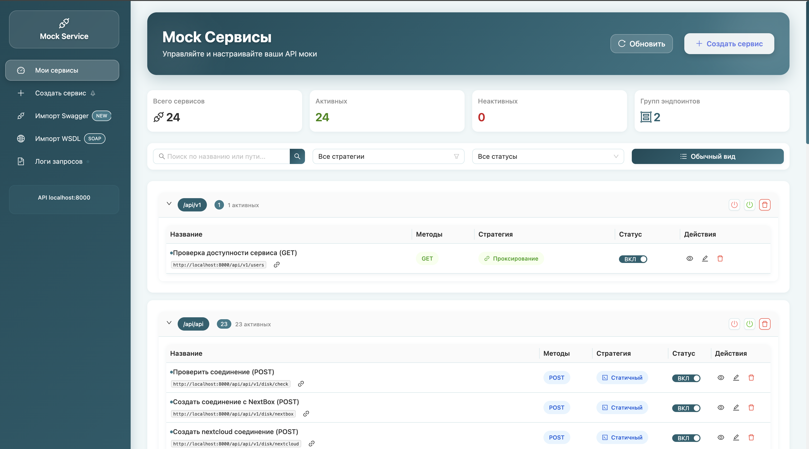

# Mock Service

> **Инструмент для создания и управления mock API эндпоинтами с современным веб-интерфейсом**

Mock Service позволяет быстро создавать имитации API для тестирования, разработки и демонстрации приложений. Поддерживает REST, SOAP, условную логику на Python и многое другое.



## Ключевые возможности

### **Три стратегии ответов**

- **Проксирование** - Перенаправление запросов на реальные API с настройкой задержек
- **Статичные ответы** - Фиксированные ответы с кастомными заголовками
- **Условная логика** - Динамические ответы на основе Python кода

### **Продвинутые функции**

- **Настройка задержек** - Имитация медленных API и сетевых проблем
- **Поддержка SOAP** - Полная поддержка SOAP/XML с автоматическим парсингом
- **Логи в реальном времени** - WebSocket мониторинг всех запросов
- **Современный UI** - Интуитивный интерфейс с примерами кода
- **Импорт схем** - Swagger/OpenAPI и WSDL импорт
- **Docker Ready** - Простой запуск через docker-compose

## Быстрый старт

### Требования

- Docker и Docker Compose
- Свободные порты 8001 и 8080

### Запуск за 1 минуту

```bash
# Клонируйте репозиторий
git clone <repository-url>
cd mock-service

# Запустите все сервисы
docker-compose up -d

# Откройте браузер
open http://localhost:8001
```

### Доступные адреса

- **Веб-интерфейс**: http://localhost:8001
- **API документация**: http://localhost:8080/docs
- **Mock API**: http://localhost:8080

## Основные концепции

### Проксирование

Перенаправляет запросы на существующие API. Идеально для:

- Тестирования с реальными данными
- Добавления задержек к существующим API
- Логирования запросов к внешним сервисам

**Пример настройки:**

```
Путь: /api/users/{id}
URL: https://jsonplaceholder.typicode.com/users/{id}
Задержка: 1.5 секунды
```

### Статичные ответы

Возвращает заранее настроенные ответы. Используется для:

- Быстрого прототипирования
- Демонстрации UI без backend
- Тестирования edge cases

**Пример ответа:**

```json
{
  "id": 123,
  "name": "John Doe",
  "email": "john@example.com",
  "status": "active"
}
```

### Условная логика

Выполняет Python код для создания динамических ответов. Мощный инструмент для:

- Сложной бизнес-логики
- Симуляции различных сценариев

**Доступные переменные:**

- `headers` - HTTP заголовки
- `query` - Query параметры
- `body` - Тело запроса
- `method` - HTTP метод
- `path` - URL путь
- `json` - Парсированный JSON
- `path_params` - Параметры из URL

---

## Практические примеры

### Пример 1: Простой REST API пользователей

**Создайте mock сервис:**

- Путь: `/api/users`
- Методы: `GET, POST`
- Стратегия: `Условный ответ`

**Код условий:**

```python
# Получаем параметры запроса
user_id = query.get("id", "")
limit = int(query.get("limit", 10))

# Проверяем авторизацию
is_authenticated = 'authorization' in headers
user_role = headers.get('x-user-role', 'guest')
```

**Варианты ответов:**

| Условие                                     | Ответ                                           | Код |
| ------------------------------------------- | ----------------------------------------------- | --- |
| `method == "GET" and user_id != ""`         | `{"id": user_id, "name": "User " + user_id}`    | 200 |
| `method == "GET" and is_authenticated`      | `{"users": [], "total": 0, "limit": limit}`     | 200 |
| `method == "GET"`                           | `{"error": "Требуется авторизация"}`            | 401 |
| `method == "POST" and user_role == "admin"` | `{"id": 123, "message": "Пользователь создан"}` | 201 |
| `method == "POST"`                          | `{"error": "Недостаточно прав"}`                | 403 |

---

### Пример 2: Платежная система с валидацией

**Настройка:**

- Путь: `/api/payments`
- Метод: `POST`
- Стратегия: `Условный ответ`

**Код условий:**

```python
# Извлекаем данные платежа
amount = 0
card_number = ""
currency = "USD"

if json:
    amount = json.get("amount", 0)
    card_number = json.get("card_number", "")
    currency = json.get("currency", "USD")

# Определяем тип карты
card_type = "unknown"
if card_number.startswith("4"):
    card_type = "visa"
elif card_number.startswith("5"):
    card_type = "mastercard"

# Проверки безопасности
is_suspicious = amount > 10000
is_blocked_card = card_number == "4444444444444444"
```

**Варианты ответов:**

| Условие                     | Ответ                                                       | Код | Задержка |
| --------------------------- | ----------------------------------------------------------- | --- | -------- |
| `amount <= 0`               | `{"error": "Неверная сумма"}`                               | 400 | 0        |
| `card_number == ""`         | `{"error": "Номер карты обязателен"}`                       | 400 | 0        |
| `is_blocked_card`           | `{"error": "Карта заблокирована"}`                          | 422 | 1.0      |
| `is_suspicious`             | `{"status": "pending", "message": "Требует подтверждения"}` | 202 | 3.0      |
| `card_type == "visa"`       | `{"transaction_id": "tx_123", "status": "approved"}`        | 200 | 2.0      |
| `card_type == "mastercard"` | `{"transaction_id": "tx_456", "status": "approved"}`        | 200 | 1.5      |
| `True`                      | `{"error": "Неподдерживаемый тип карты"}`                   | 422 | 0.5      |

---

### Пример 3: SOAP веб-сервис

**Настройка:**

- Путь: `/soap/UserService`
- Метод: `POST`
- Стратегия: `Условный ответ`
- Заголовки:
  ```
  Content-Type: text/xml; charset=utf-8
  SOAPAction: "getUserInfo"
  ```

**Код условий:**

```python
import re

# Парсим SOAP envelope
user_id = ""
operation = ""

# SOAPAction из заголовков
soap_action = headers.get("soapaction", "").strip('"')

if body:
    try:
        # Убираем переносы строк для regex
        clean_body = re.sub(r'\s+', ' ', body)

        # Извлекаем userId с поддержкой namespace
        patterns = [
            r'<(?:\w+:)?userId[^>]*>([^<]+)</(?:\w+:)?userId>',
            r'<userId[^>]*>([^<]+)</userId>'
        ]

        for pattern in patterns:
            match = re.search(pattern, clean_body, re.IGNORECASE)
            if match:
                user_id = match.group(1).strip()
                break

        # Определяем операцию
        if 'getUserInfo' in soap_action:
            operation = "getUserInfo"

    except Exception:
        user_id = ""
```

**SOAP ответы:**

**Успешный ответ:**

```xml
<?xml version="1.0" encoding="UTF-8"?>
<soap:Envelope xmlns:soap="http://schemas.xmlsoap.org/soap/envelope/">
    <soap:Body>
        <GetUserInfoResponse>
            <User>
                <UserId>${user_id}</UserId>
                <FullName>John Doe</FullName>
                <Email>john@example.com</Email>
                <Status>ACTIVE</Status>
            </User>
        </GetUserInfoResponse>
    </soap:Body>
</soap:Envelope>
```

**Тестирование SOAP:**

```bash
curl -X POST \
     -H "Content-Type: text/xml; charset=utf-8" \
     -H "SOAPAction: \"getUserInfo\"" \
     -d '<?xml version="1.0" encoding="UTF-8"?>
<soap:Envelope xmlns:soap="http://schemas.xmlsoap.org/soap/envelope/">
    <soap:Body>
        <GetUserInfo>
            <userId>123</userId>
        </GetUserInfo>
    </soap:Body>
</soap:Envelope>' \
     http://localhost:8080/soap/UserService
```

---

### Пример 4: Временные ограничения и бизнес-логика

**Код условий:**

```python
import datetime

# Текущее время
now = datetime.datetime.now()
current_hour = now.hour
current_weekday = now.weekday()  # 0=понедельник

# Бизнес-логика
is_business_hours = 9 <= current_hour <= 17
is_weekend = current_weekday >= 5
is_maintenance = current_weekday == 6 and 2 <= current_hour <= 4

# Пользовательские данные
user_role = headers.get('x-user-role', 'guest')
is_premium = user_role == 'premium'
```

**Варианты ответов:**

| Условие                                    | Ответ                                                     | Код |
| ------------------------------------------ | --------------------------------------------------------- | --- |
| `is_maintenance`                           | `{"error": "Техническое обслуживание"}`                   | 503 |
| `not is_business_hours and not is_premium` | `{"error": "Сервис доступен только в рабочие часы"}`      | 423 |
| `is_weekend and user_role == 'guest'`      | `{"message": "Ограниченный доступ в выходные"}`           | 200 |
| `True`                                     | `{"status": "available", "message": "Добро пожаловать!"}` | 200 |

---

## Дополнительные возможности

### Импорт схем

**Swagger/OpenAPI:**

1. Перейдите в раздел "Импорт Swagger"
2. Загрузите файл или вставьте URL
3. Выберите эндпоинты для импорта
4. Mock сервисы создадутся автоматически

**WSDL (SOAP):**

1. Раздел "Импорт WSDL"
2. Укажите URL WSDL файла
3. Настройте базовый путь
4. Выберите операции для импорта

### Мониторинг и логи

**Просмотр запросов:**

- Все логи: раздел "Логи запросов"
- По сервису: кнопка "Логи" рядом с сервисом
- Реальное время: включите переключатель

**Фильтрация:**

- По тексту (путь, метод, тело)
- По дате
- По конкретному сервису

**Информация в логах:**

- Время запроса
- HTTP метод и путь
- Заголовки запроса/ответа
- Тело запроса/ответа
- Время обработки
- Статус код

---

## API Reference

### Mock сервисы

```http
GET    /api/mock-services/        # Список сервисов
POST   /api/mock-services/        # Создать сервис
GET    /api/mock-services/{id}    # Получить сервис
PUT    /api/mock-services/{id}    # Обновить сервис
DELETE /api/mock-services/{id}    # Удалить сервис
```

### Логирование

```http
GET /api/mock-services/logs/all         # Все логи
GET /api/mock-services/{id}/logs        # Логи сервиса
WS  /ws/logs                            # WebSocket все логи
WS  /ws/logs/{id}                       # WebSocket логи сервиса
```

### Импорт

```http
POST /api/swagger/parse        # Парсинг Swagger
POST /api/swagger/import       # Импорт сервисов
POST /api/wsdl/parse          # Парсинг WSDL
POST /api/wsdl/import         # Импорт SOAP операций
```

---

## Полезные примеры кода

### Python код для условий

**Авторизация:**

```python
# Проверка токена
auth_token = headers.get('authorization', '')
is_authenticated = auth_token.startswith('Bearer ')

# Роли пользователей
user_role = headers.get('x-user-role', 'guest')
is_admin = user_role == 'admin'
```

**Валидация данных:**

```python
# JSON валидация
if json:
    email = json.get('email', '')
    is_valid_email = '@' in email and '.' in email
    age = json.get('age', 0)
    is_adult = age >= 18
```

**Работа с датами:**

```python
import datetime
now = datetime.datetime.now()
is_business_hours = 9 <= now.hour <= 17
is_weekend = now.weekday() >= 5
```
